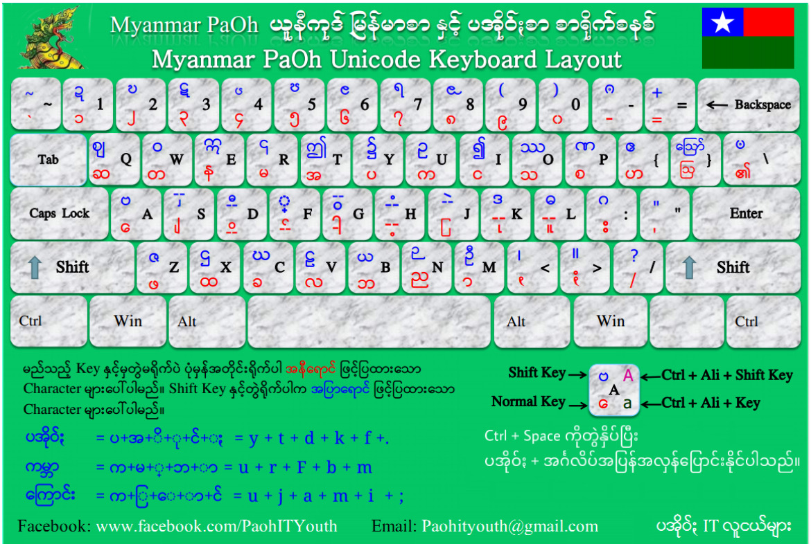

# macOS PaOh Keyboard

Apple macOS မှာ ပအိုဝ်းစာရေးလို့ရတဲ့ ကီးဘုတ်လက်ကွက်လေးကို ၂၀၁၅ လောက်ကတည်းက [Khun San Htet Aung](https://www.facebook.com/khunsan.htetaung) လုပ်ပေးထားတာပါ။
macOS မှာ Default ပါလာတဲ့ Myanmar လက်ကွက်ကို မုဲင်ꩻငါ နဲ့ မုဲင်ꩻပတ်ငါထပ်ဖြည့်ပေးထားတာပါ။
ယေဘုယျအားဖြင့် ပအိုဝ်းစာဟာမြန်မာစာထက် မုဲင်ꩻငါ နဲ့ မုဲင်ꩻပတ်ငါ ပဲပိုသွားတာဖြစ်တဲ့အတွက်
ပအိုဝ်းကီးဘုတ်လက်ကွက်တွေကို မြန်မာစာရေးဖို့အတွက်လည်းသုံးလို့ရပါတယ်။
အခုကျနော်က Terminal ကနေ Command တစ်ကြောင်းရိုက်ရုံနဲ့ Install/Uninstall လုပ်နိုင်အောင် Script လေးရေးပေးထားပါတယ်။
တစ်ယောက်ယောက်လာမေးတိုင်း Google မှာပြန်ပြန်မွှေနေရတာမလို့ Github Repository လေးဆောက်ပြီးသိမ်းထားဖို့ဆုံးဖြတ်လိုက်တာပါ။
ထည့်သွင်းနည်းကတော့လွယ်ပါတယ်။
ဒီ **Repository** ကိုဒေါင်းပြီး **paoh_kb.sh** ကို **Run** လိုက်ရုံပါပဲ။

    # Download လုပ်ခြင်း
    curl -o- -L https://github.com/KhunHtetzNaing/macOS-PaOh-Keyboard/raw/main/download.sh | bash && cd pao-kb
    
    # Install လုပ်ရန်
    ./paoh_kb.sh install
    
    # Uninstall ပြန်လုပ်လိုလျှင်
    ./paoh_kb.sh uninstall
ပြီးရင် System Preferences ထဲက Keyboard > Input Sources ထဲမှာ PaOh ကို Add လိုက်ရုံနဲ့ ပအိုဝ်းစာစရေးလို့ရပါပြီ။

# စာရိုက်နည်း
ယူနီကုဒ်စာရိုက်နည်းအတိုင်း သဝေထိုး ကိုနောက်မှရိုက်ရပါတယ်။
ဥပမာ
ကျောင်း = က + ျ + ေ + ာ + င + ်​ + း
ကမ္ဘာ = က + မ + ္ + ဘ + ာ
ကျန်တာကတော့ သင်ဘုန်းကြီးစာရေးနည်းအတိုင်းရေးရပါတယ်။
သင်ဘုန်းကြီးစနစ်အတိုင်း သဝေထိုးကိုလည်း အတိုင်းရိုက်ချင်ရင်တော့ [Keymagic](https://keymagic.net/) ကိုသုံးနိုင်ပါတယ်။

# Manual ထည့်သွင်းနည်း

 - PaOh.bundle ဖိုင်ကိုဒေါင်းပါ။
 - ပြီးရင် Copy ကူးပြီး Macintosh HD > Users > Library > Keyboard Layouts ထဲမှာ Paste လုပ်ပါ။
  - System Preferences ကိုဖွင့်ပြီး Keyboard > Input Sources ထဲကိုဝင်ပါ။ 
  - \+ ကိုနှိပ်ပြီး PaOh ကို Add လိုက်ရင်ရပါပြီ။
  - Ctrl + Space စုံနှိပ်ပြီး လက်ကွက်အပြန်အလှန်ပြောင်းနိုင်ပါတယ်။